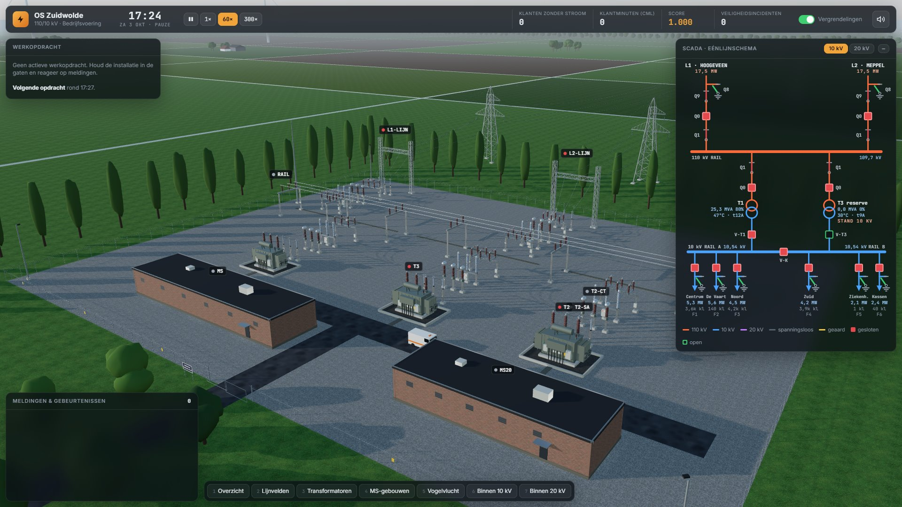
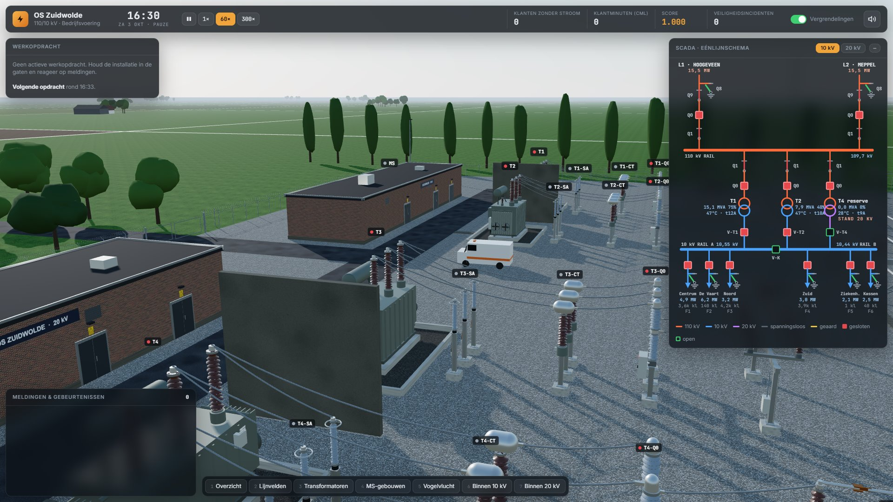
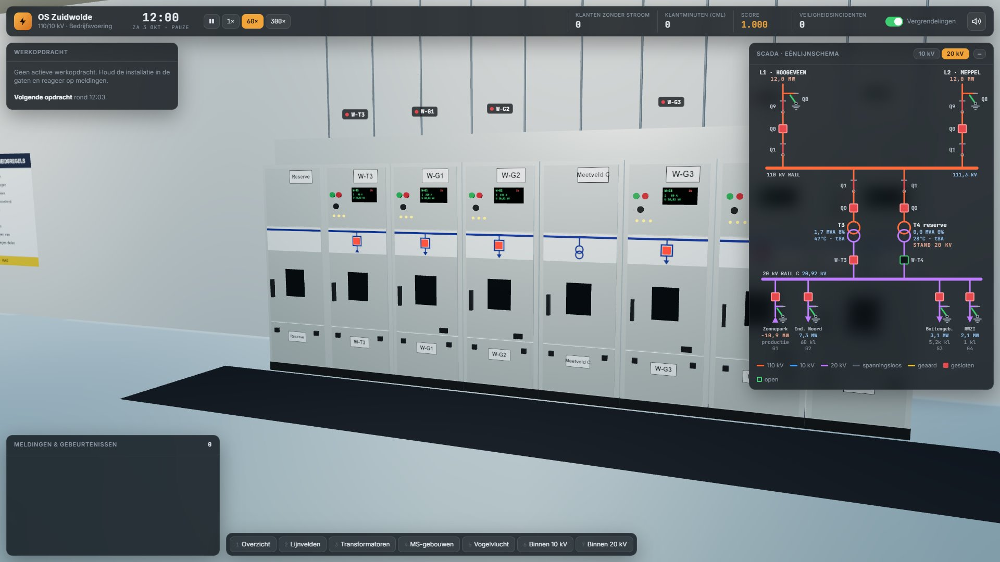
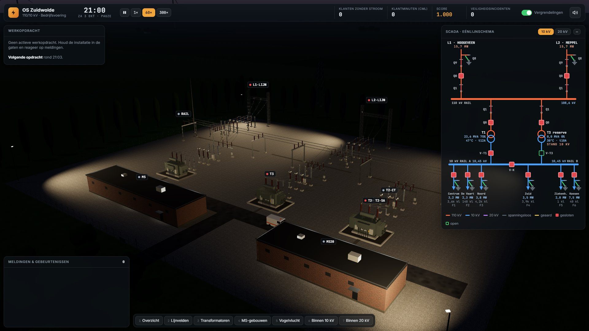
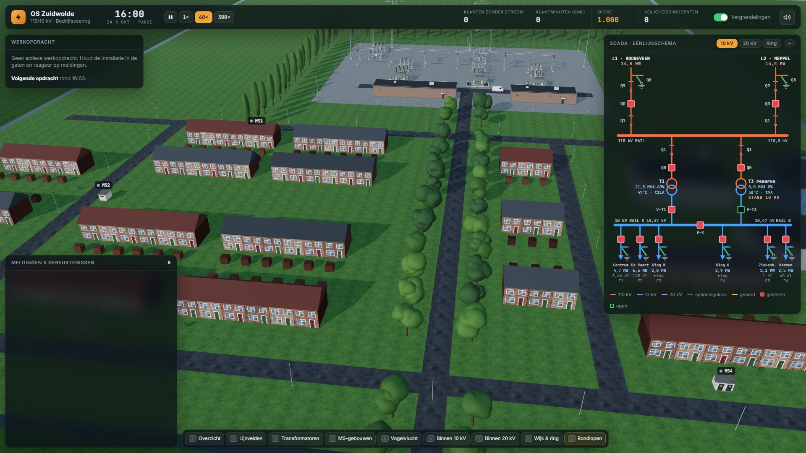
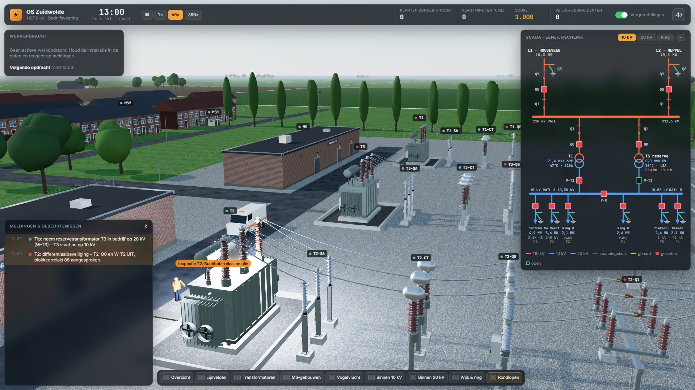

# Onderstation Simulator: OS Zuidwolde 110/10/20 kV

Een 3D-onderstationsimulator die in de browser draait (Three.js, geen installatie nodig).



**Spelen:** dubbelklik op `index.html` (internet nodig voor Three.js en lettertypen via CDN).

| Transformatorvelden T1–T3 | 20 kV-schakelinstallatie binnen | 's Nachts met terreinverlichting |
|---|---|---|
|  |  |  |

| Wijk met de 10 kV-ring | Monteurs bij een inspectie |
|---|---|
|  |  |

## Bediening
- Klik op een schakelaar in 3D of in het SCADA-schema en kies vervolgens IN/UIT of SLUITEN/OPENEN.
- Linker muisknop draaien, rechter muisknop schuiven, scrollen om te zoomen.
- `1`–`9` camerastandpunten (6 = binnen 10 kV, 7 = binnen 20 kV, 8 = woonwijk, 9 = centrum en De Vaart)
- **Rondlopen (first person):** druk op `V` of op de knop *Rondlopen*.
  - Je loopt met `WASD`, rent met `Shift` en kijkt rond met de muis.
  - Richt het kruis op een schakelaar: `F` schakelt direct. `E` maakt de cursor vrij (en opent het paneel als je naar een schakelaar kijkt), zodat je ook in het SCADA-schema kunt schakelen. Met nog een keer `E` loop je verder.
  - Je loopt niet door apparatuur, muren, huizen of het hek. De gebouwen kun je via de deuren in, en via de open poort loop je de wijk in naar de MS-stations.
  - Met `V` stop je met rondlopen; met nog een keer `V` ga je verder waar je was.
  - Lopen gaat met 2,2 m/s, rennen met `Shift` met 8 m/s en sprinten met `Q` met 16 m/s. Met `spatie` spring je; pauzeren gaat tijdens het rondlopen met `P`.
  - Met `Z` zet je je **zaklamp** aan of uit. Handig 's nachts op het terrein, in een donker MS-station of bij een storing in het gebouw.
- **Pauzemenu (`Esc`):** hervatten, de dienst beëindigen met rapport, of de score opslaan en terug naar het hoofdmenu.
- **Klaar om te schakelen:** als de storingsdienst of TenneT klaar is, of een transformator weer gereset mag worden, hoor je een oplopend klokgeluid en verschijnt een groene banner. Het betreffende veld knippert groen in SCADA en in 3D tot je het schakelt. · `spatie` pauze · `L` labels · `M` geluid · `Esc` deselecteren

## Installatie
- **110 kV:** twee lijnvelden (L1 Hoogeveen, L2 Meppel), een railsysteem en drie transformatorvelden.
- **T1** (110/10,5 kV, 31,5/40 MVA) voedt de 10 kV-installatie. Dat is een **dubbelrailsysteem**: rail A en rail B, normaal gekoppeld via V-K, met de velden F1–F6.
  - Elk veld (ook V-T1 en V-T3) heeft twee **railkeuzescheiders**: QA naar rail A en QB naar rail B. Normaal staan F1–F3 en T1 op rail A, en F4–F6 en T3 op rail B.
  - **Omzetten onder last** mag alleen als V-K gesloten is: eerst de scheider naar de nieuwe rail sluiten, dan de oude openen. Zonder koppeling blokkeert de vergrendeling (of, met de vergrendelingen uit, ontstaat er een vlamboog). V-K kan niet open zolang een veld op beide rails staat.
  - Railaardschakelaars RA-Q8 en RB-Q8 zitten in de meetvelden.
- **T2** (110/21 kV, 20/25 MVA) voedt de 20 kV-installatie in het tweede gebouw. Die heeft twee railhelften:
  - **rail C1** met W-T2, G1 Zonnepark (productie en teruglevering) en G2 Industrieterrein Noord;
  - **rail C2** met W-T3, G3 Buitengebied Oost en G4 Waterzuivering;
  - de **railkoppeling W-K** (normaal gesloten, met synchrocheck tot 0,5 kV verschil) en per railhelft een **railaardschakelaar** (RC-Q8, RD-Q8) in het meetveld.
- **T3** is de omschakelbare reservetransformator (110/10,5-21 kV, 20/25 MVA).
  - Hij staat als warme reserve op 10 kV.
  - Via **V-T3** voedt hij 10 kV-rail B, via **W-T3** 20 kV-rail C2 (en via W-K ook C1).
  - Omschakelen kan alleen spanningsloos (T3-Q0, V-T3 en W-T3 UIT).
  - Inschakelen op de verkeerde spanning blokkeert de vergrendeling. Met de vergrendelingen uit leidt het tot een incident en wikkelingsschade.
  - Let op: T3 is kleiner dan T1. Neemt hij tijdens de avondpiek de hele 10 kV over, dan raakt hij overbelast.
- **Twee 10 kV-ringen achter het station:**
  - **Ring Woonwijk:** V-F3 (rail A) → MS1–MS5 → V-F4 (rail B), normaal-open punt **MS3-R**.
  - **Ring Centrum – De Vaart:** V-F1 → MS6 Marktplein → MS7 Stationsstraat ‖ MS8 De Vaart Noord → MS9 De Vaart Zuid → V-F2, normaal-open punt **MS7-R**. Het centrum heeft appartementen met winkels, een plein en een station; bedrijventerrein De Vaart heeft hallen, een bouwmarkt en een tankstation.
  - Elk station heeft lastscheiders naar links en rechts, een transformatorschakelaar, een 10/0,4 kV-trafo en laagspanningsvelden naar woonwijken, een school, een supermarkt, een huisartsenpost, een laadplein en bedrijven.
  - Bij een kabelfout spreken **kortsluitverklikkers** aan bij de stations tussen het voedingspunt en de fout. Isoleer de kabel achter het laatste station met een verklikker, sluit het normaal-open punt en schakel het veld weer in.
- **Stroom en spanning in de ringkabels:** per kabelsectie wordt de belastingstroom berekend (rating 330 A, kopkabels 400 A), plus de spanning per station inclusief het spanningsverlies over de kabels.
  - In SCADA zie je de stroom per veld, MW en kV per station, en kabels die oranje of rood knipperen bij hoge belasting.
  - Bij overbelasting krijg je een alarm. Blijft een kabel lang boven 130 %, dan brandt hij door.
- **Straatverlichting:** elk MS-station heeft een LS-veld *Openbare verlichting* met een schemerschakeling. Alle lantaarns hangen aan het dichtstbijzijnde station en gaan uit als dat station of het OVL-veld spanningsloos is, met een lichtvlek op straat als ze branden.
- **Inloop-MS-stations:** elk ringstation kun je in, via de open deur of met de knop *Naar binnen* in het stationspaneel. Binnen staan:
  - een compacte RMU met de velden L, T en R, met standmelders, spanningslampjes en een kortsluitverklikker (KSV);
  - een laagspanningsrek met een hoofdschakelaar en NH-lastscheiders per LS-veld (de klep gaat echt open of dicht);
  - de distributietransformator achter een gaashek.
  Schakelen gaat met het richtkruis: `F` voor direct schakelen, `E` voor het paneel.
- **Schakelbrieven (optioneel):** bij een werkopdracht zie je de stappen meteen en kun je gewoon schakelen. Wil je bonuspunten, kies dan vóór de eerste stap *Zelf een schakelbrief opstellen*. Je kiest de handelingen (er zitten afleiders tussen), zet ze in volgorde en dient de brief in bij wachtchef Marieke.
  - Goedgekeurd: +40 (+15 na correcties). Afgekeurd: −10, met uitleg waarom die stap niet klopt. Hint: −5.
  - Ben je aan een brief begonnen, dan zie je de stappen pas na goedkeuring. Wijk je daarna af van je goedgekeurde brief, dan kost dat −25. Zonder brief is er geen straf.
- **Portofoon:** monteurs hebben een naam en melden zich bij aankomst en als het werk klaar is. Wil je schakelen aan of vlakbij hun werk, dan opent eerst het portofoonvenster:
  - **melden**: de monteur bevestigt en daarna wordt er geschakeld (+10);
  - **zonder melden schakelen**: −50 en een boze monteur;
  - **annuleren**.
- **Monteurs:** collega's in een veiligheidsvest lopen het station of de wijk in bij inspecties, werkopdrachten en kabelfouten, en vertrekken weer als het werk klaar is.
- **Dienstoverdracht** (bij diensten en scenario's, niet bij vrij spelen of de lessen): bij de start geeft de operator van de vorige dienst een overdracht.
  - Je ziet alle afwijkingen van de normale toestand, automatisch uit de installatie gehaald, plus het weer en de verwachte piek.
  - Bij dag- en avonddiensten begint het station met 2–3 willekeurige afwijkingen. Voorbeelden: AR van een lijn nog uit na een relaistest, het normaal-open punt verlegd, F5 tijdelijk op rail A, T3 nog op 20 kV, L2 in onderhoud, of de kassen uit tot een afgesproken tijd.
  - Open punten staan links bij je dienst; elk netjes afgehandeld punt geeft +25. Afspraken niet nakomen (bijvoorbeeld te vroeg inschakelen) kost −20.
- **Belastingprognose** (tabblad *Prognose*): de verwachte belasting op 10 en 20 kV voor de komende 8 uur, met seizoen en het huidige weer, afgezet tegen de capaciteit van de transformatoren in bedrijf (en met T3 erbij).
  - Je ziet de piek, het moment van overbelasting en een advies (T3 bijschakelen, kassen afschakelen), plus een N-1-tip.
  - Dreigt er binnen 1,5 uur overbelasting, dan krijg je een melding.
- **Telefoon en klantmeldingen:** klanten bellen bij uitval. De telefoon gaat over bovenin beeld; neem op en kies je antwoord:
  - *“Dat is bekend, we werken eraan”* bij uitval die je in SCADA ziet (+5);
  - *“Laat uw installateur kijken”* als alleen één woning zonder stroom zit (+10);
  - *monteur sturen naar een MS-station* bij een **LS-storing**: een doorgebrande zekering in een laagspanningsveld. Die zie je **niet** in SCADA, alleen via klantmeldingen. Zoek het adres op in het ringschema (welke straat hangt aan welk station) en stuur de monteur naar het goede station (+60 bij snel herstel, −20 bij een verkeerd station). Ook vanuit het stationspaneel kun je een monteur sturen.
  - Neemt niemand op, dan hangt de klant na ±45 s op (−5).
- **Netcongestie en flexibel vermogen** (toets `C` of de knop *Flex*):
  - Een overzicht toont de zwaarst belaste kabels en transformatoren.
  - Zeven klanten hebben een flexcontract: het laadplein (slim laden), het transportbedrijf (e-trucks later laden), het koelhuis, de metaalbewerking, de batterij van het distributiecentrum, de kassen (belichting dimmen) en het zonnepark (terugregelen).
  - Je vraagt ze 25–100% terug te regelen. Na ±2 min is het actief; de vergoeding (€/MWh) gaat van je score af (1 punt per € 100). Dat is meestal veel goedkoper dan uitval.
  - De distributietrafo's in de MS-stations zijn gedimensioneerd op hun winterpiek (2000–3150 kVA). Zit een trafo lang boven 120%, dan slaan de MS-zekeringen door; de monteur plaatst nieuwe en pas daarna mag de transformatorschakelaar weer dicht. Vanaf 105% krijg je een waarschuwing.
- **Veroudering en preventief onderhoud** (toets `O` of de knop *Onderhoud*):
  - Elke vermogenschakelaar heeft een conditie, een aantal schakelingen en een jaar van de laatste revisie. Schakelen slijt een beetje, het afschakelen van een foutstroom veel meer.
  - Een versleten veldschakelaar kan bij een storing **weigeren**. De reservebeveiliging (50BF) schakelt dan de hele rail af en de schakelaar zit mechanisch vast. Open zijn railkeuzescheider zolang de rail spanningsloos is (dat mag dan), neem de rail weer in bedrijf en laat hem reviseren.
  - De werkopdracht *Revisie vermogenschakelaar* komt vanzelf bij een slechte conditie, of plan hem zelf in vanuit het overzicht. Bij een ringveld sluit je eerst het normaal-open punt en maak je de kabel ook aan de ringkant vrij.
- **Werk staken:** onder elke werkopdracht staat *Werk staken*. Dat gebruik je bij een storing waarvoor je de installatie nodig hebt, bijvoorbeeld T3 die bij onderhoud aan T2 meedraait terwijl T1 uitvalt.
  - Alles wat al geschakeld is, wordt een herstelprogramma in omgekeerde volgorde (eerst de aarding eraf, als laatste de reserve terug).
  - Na het herstel krijg je +30. Staken zonder storing kost −20; staken vanwege een storing kost niets.
- **Beveiligingsinstellingen** (toets `B` of de knop *Beveiliging*):
  - **I> per uitgaand veld** (110–150 %) en een **tijdfactor** (×0,5–×2). Te scherp: koude-lastopname leidt tot afschakeling. Te ruim: een langdurig overbelaste kabel raakt beschadigd.
  - **AR dode tijd per lijn** (0,3 / 1 / 3 s). Kort: de herinschakeling mislukt soms omdat de boog nog niet gedoofd is. 3 s: altijd raak, maar draait het station op één lijn, dan vallen processen bij klanten uit.
  - **Thermische trip per trafo** (95 / 100 / 110 °C). Hoog geeft meer reserve, maar boven 105 °C ontstaat gasvorming en dreigt een Buchholz-trip met een lange inspectie.
- **SCADA** heeft tabbladen voor 10 kV, 20 kV, de ring en de **prognose**. Zoomen kan met de knoppen **−/+**, met `Ctrl` + scrollwiel of met de toetsen `+` en `−` (75–250 %). Het paneel wordt dan mee breder.

## Leven in de wijk
- **Verlichte ramen:** 's avonds gaat het licht aan in de woningen en appartementen; laat in de nacht nog maar een paar. Elk huis hangt aan het dichtstbijzijnde MS-station: valt dat station uit, dan gaan de lichten in die buurt uit. Bij een noodaggregaat blijven ze branden.
- **Verkeer:** een dozijn auto's rijdt rechts over de straten van beide wijken, met koplampen en een lichtbundel in het donker. In de spits rijden er meer.
- **Buren:** zit een station een paar minuten zonder stroom, dan komen de buren naar buiten; 's avonds met de zaklamp van hun telefoon.

## Geluid
Alle geluid wordt in de browser gemaakt (Web Audio) en hangt af van waar je bent:
- **In de MS-gebouwen:** zoemen van de installatie en ventilatie.
- **In een MS-station:** trafobrom die meegroeit met de belasting.
- **Op het 110 kV-terrein:** transformatorbrom en corona-geknetter (sterker bij regen en mist).
- **In de wijk:** verkeersgeruis, passerende auto's, vogels overdag en krekels op zomer- en lenteavonden.
- **Overal:** wind, regen en onweer.

## Seizoenen en weer
- **Seizoenen** (lente, zomer, herfst, winter) kies je in het menu. Ze bepalen:
  - zonsopkomst, zonsondergang en zonnehoogte;
  - de buitentemperatuur;
  - de belasting (winter: verwarming, zomer: airco);
  - de opbrengst van het zonnepark;
  - de schakeltijden van kassen en straatverlichting.
- **Weer:** helder, bewolkt, regen, onweer, mist, sneeuw (met sneeuwdek) en hittegolf, wisselend tijdens een dienst. Het weer beïnvloedt:
  - lucht en zicht;
  - neerslag;
  - transformatortemperaturen;
  - zonne-opbrengst;
  - de kans op blikseminslag.
- De weerindicator met de buitentemperatuur staat in de bovenbalk. Voor testen kun je `?season=winter&weer=sneeuw` gebruiken.

## Spelmodi en score
- **Vrije dienst:** eindeloos spelen.
- **Dagdienst** (07–15 u) en **Avonddienst** (15–23 u): een dienst van 8 uur met een dienstrapport, een cijfer (A+ t/m E), sterren, badges en een highscore.
- **Leerscenario's** met uitleg, stap voor stap. De schakelaar die je moet bedienen knippert groen en de les gaat vanzelf verder als je het goed doet:
  1. *Bediening en SCADA*: selecteren, een veld uit- en inschakelen, klantminuten.
  2. *Vrijschakelen en aarden*: de vijf veiligheidsregels op de kabel van F6.
  3. *Kabelfout in de ring*: verklikkers lezen, isoleren en terugvoeden via het normaal-open punt.
  4. *Reservetransformator T3*: T2 valt uit; T3 omschakelen naar 20 kV en beide railhelften voeden.
  5. *Spanningsregeling*: de trappenschakelaar met de hand bedienen en de AVR het laten overnemen.
- **Scenario's:**
  - *Kabelstoring ziekenhuis*: T1 valt uit en het ziekenhuis draait op noodstroom.
  - *Storm boven Drenthe*: regen, onweer, blikseminslagen en een defect AR-relais.
  - *Avondpiek op één poot*: T1 staat in onderhoud en reservetransformator T3 draagt de 10 kV; schakel de kassen af om T3 heel te houden.
  - *Black-out*: bouw het station weer op.
  - *Hittegolf* (zomer, ±36 °C): de ventilatoren van T1 vallen uit en een kabel in het centrum bezwijkt door de hitte.
  - *Winteravond met sneeuw*: hoge belasting, een ringfout met terugvoeden zonder kabels te overbelasten, en daarna een lijnstoring.
  - *Dubbele kabelfout in de woonwijk*: twee fouten tegelijk; een eiland tussen de fouten komt pas na de eerste reparatie terug.
  - *Aanrijding MS-station*: een vrachtwagen ramt MS5. De RMU is onbedienbaar; isoleer vanaf MS4 en voed terug via het normaal-open punt. Later volgt een noodaggregaat.
  - *Cyberaanval op SCADA*: bediening op afstand valt weg. Loop het station in (`V`) en schakel lokaal aan het veld, terwijl de kassen en lijn L1 uitvallen.
  - *Overstroming De Vaart*: het water stijgt bij MS9. Sluit het normaal-open punt, haal MS9 uit de ring (MS8-R open, V-F2 uit) vóór het water er is, en neem MS9 na het droogvallen weer in bedrijf.
  - *Kraan raakt de 110 kV-lijn*: L1 is urenlang weg en TenneT laat via L2 maar 26 MW toe tijdens de avondpiek; blijf eronder met flexibel vermogen.
  - *Brand in het 10 kV-gebouw*: rook uit het dak. De brandweer wil de hele 10 kV spanningsloos voordat ze naar binnen gaat; het ziekenhuis draait op noodstroom. Daarna stap voor stap herstellen (V-F6 heeft rookschade).
  - *Concert op het Marktplein*: podium, lichtshow en foodtrucks overbelasten MS6; het podium heeft een flexcontract.
  - *Laadpiek op een winteravond*: een uitgebreid laadplein en thuisladers in de hele woonwijk; congestie in trafo's en kabels.
  - *Zonnepiek*: een uitgebreid zonnepark (60 MWp) levert op een lentedag meer terug dan T2 aankan. Zet T3 op 20 kV parallel om T2 heel te houden zonder het zonnepark af te schakelen.
- **Rapport met tijdlijn en herhaling:** na afloop zie je een tijdlijn met klanten zonder stroom, je score, storingen (rood), je handelingen en behaalde doelen.
  - *Leermomenten* noemen de langste onderbrekingen (met je reactietijd) en waar je punten liet liggen, met een tip per fout.
  - Met *▶ Herhaling*, of door op de tijdlijn of een leermoment te klikken, speel je de dienst opnieuw af. SCADA, de 3D-installatie en de tellers tonen dan de toestand van dat moment; met de schuifbalk spoel je door.
- **Moeilijkheid:** Rustig, Normaal of Zwaar. Dit bepaalt hoe vaak storingen optreden en hoe vaak een fout blijvend is.
- **Score:** je begint met 1.000 punten.
  - Erbij: snel herstel van een onverwachte onderbreking (+20 of +40), een behaald doel (+100), een voltooide werkopdracht (+150) en een dienst zonder incidenten (+200).
  - Eraf: klantminuten, het ziekenhuis zonder net, veiligheidsincidenten (−150), een gemist doel (−150), thermische trips (−100), inschakelen op een fout (−40), overbelasting (−30), spanningsafwijkingen en circulatiestroom (−20).
- Tijdens een pauze kun je niet schakelen.

## 10 kV-gebouw
Binnen staat een rij van 13 metaalomsloten schakelvelden (V-T1, F1–F3, meetveld, koppeling V-K, F4–F6, V-T3). In het 20 kV-gebouw staan W-T2, G1, G2, meetveld C1 met RC-Q8, koppeling W-K, meetveld C2 met RD-Q8, G3, G4 en W-T3. Elk veld heeft een live display, mimic-schema met standmelder en spanningslampjes. Klik op een veld om het te bedienen. Verder: beveiligingskasten, bedieningsbureau met live SCADA- en meldingenscherm, accubatterij en eigenbedrijfstransformator.

## Spelregels (bewust simpel)
- Een scheider (Q1/Q9) schakel je alleen als de vermogenschakelaar (Q0) van hetzelfde veld UIT staat. Doe je dat met de vergrendelingen uit, dan ontstaat er een vlamboog.
- Sluit een aardschakelaar (Q8) alleen op een spanningsloze lijn.
- Willekeurige storingen: blikseminslag op een lijn, kabelfouten, LS-storingen (alleen via de telefoon te vinden), transformatortrips (hooguit één keer per trafo per dienst) en af en toe een **railfout**. Bij een railfout schakelt de railbeveiliging alle velden van één railhelft af; die helft blijft spanningsloos tot de monteur klaar is. Inschakelen op de rail geeft een nieuwe trip.
- Werkopdrachten (alleen als de uitgangssituatie normaal is):
  - lijnveld vrijschakelen en aarden;
  - kabelwerk aan een veld of een ringkabel;
  - onderhoud T1 of T2 met de reservetransformator;
  - **onderhoud rail B (10 kV)**: alle velden van rail B onder last naar rail A omzetten, V-K open en rail B aarden, zonder dat één klant iets merkt;
  - **onderhoud railhelft C2**: G3/G4 omschakelen, W-K open en de rail aarden;
  - **onderhoud MS-station**: de klanten op een noodaggregaat, de ring sluiten en het station eruit halen;
  - **thermografie-ronde**: loop (`V`) of vlieg langs drie onderdelen. Dichtbij zie je met de warmtebeeldcamera een gloeiende hotspot, en daarna volgt direct de herstelopdracht.
- Een transformator is 20 MVA (ONAN) of 25 MVA met ventilatoren (ONAF). Draait één transformator alles tijdens de avondpiek, dan wordt hij te warm en schakelt hij af bij een olietemperatuur van 100 °C.

## Realistische bedrijfsvoering
- **Spanningsregeling:** de 110 kV-netspanning varieert over de dag. De trappenschakelaar (17 standen, 1,25 % per trap) houdt de 10 kV-rail op 10,50 kV ±1,2 %. AUTO of HAND kies je in het transformatorpaneel. Bij gekoppelde rails regelen de transformatoren als master-follower. Ongelijke trappen geven circulatiestroom en extra belasting.
- **Synchrocheck:** V-K schakelt alleen in bij minder dan 0,25 kV spanningsverschil tussen rail A en rail B, W-K bij minder dan 0,5 kV tussen C1 en C2.
- **Automatische herinschakeling (AR)** op de 110 kV-lijnen: een tijdelijke fout wordt na de dode tijd (standaard 1 s) hersteld, een blijvende fout leidt tot lockout. AR en dode tijd stel je per lijn in.
- **Inschakelveer:** na het inschakelen laadt de veer ongeveer 7 s; zolang dat duurt kan de schakelaar niet opnieuw inschakelen.
- **Blokkeerrelais 86:** na een transformatortrip handmatig resetten, en pas na de inspectie of na afkoelen tot onder 75 °C.
- **Kabelstoringen:** eerst zoekt de storingsdienst de fout (inschakelen geeft dan direct weer een trip), daarna wordt de fout geïsoleerd en kun je het veld inschakelen. Een deel van de klanten wacht nog op de reparatie.
- **Koude-lastopname:** na een lange onderbreking ligt de belasting tijdelijk tot 60 % hoger. Een vertraagde overstroombeveiliging (I>) kan dan afschakelen.
- **Aardschakelaars kabelzijde** (F1-Q8 … F6-Q8) met een opdracht voor kabelwerk, waarbij de klanten eerst via het net worden omgeschakeld.

## Tests
Automatische tests sturen de simulator aan in headless Chrome. Ze dekken onder meer vergrendelingen, vlamboog, reservetransformator, ringfout met terugvoeding, spanningsregelaar, schakelbrief, portofoon, de railsplitsing met railfout, het dubbelrailsysteem, beveiligingsinstellingen, werk staken, de onderhoudstypes, alle vijf de lessen, de prognose, de telefoon, de dienstoverdracht, de nieuwe scenario's, de tijdlijn met herhaling en het pauzemenu.

```powershell
npm install
npm test            # of: npm test -- ring   (alleen tests met 'ring' in de naam)
npm run test:scenarios          # speelt alle scenario's en beide diensten volledig uit (±12 min)
npm run test:scenarios -- storm # alleen één scenario
```

Bij `test:scenarios` speelt een automatische operator het spel uit zoals een goede speler dat doet. Hij isoleert kabelfouten, zet T3 in als reserve, voert werkopdrachten uit (met schakelbrief) en meldt zich bij monteurs. Per run zie je de score, de klantminuten, de doelen en de langste uitval. Een afwijkend resultaat speel je opnieuw met dezelfde seed: `SEED=123456`. Met `FULLLOG=1` krijg je het volledige verloop.

Beide draaien parallel met meerdere browsers tegelijk, maar zuinig, zodat de machine bruikbaar blijft:
- standaard een kwart van de processorkernen (maximaal 3, op GitHub 2); met `TEST_JOBS=…` kies je zelf;
- de tests en hun browsers draaien met **lagere prioriteit** (`TEST_PRIORITY=normal` om dat uit te zetten);
- de tests openen het spel met `?lite`: de simulatie, panelen en meldingen lopen gewoon, maar het 3D-beeld wordt niet getekend en de hoofdlus draait 15× per seconde. Zonder grafische kaart kost één 3D-beeld in software ±2 kernseconden; zo gebruikt een testbrowser in rust nog maar ±0,3 kern in plaats van alle kernen;
- de browsers tekenen de pagina (SCADA, panelen) met de gewone processor in plaats van via de software-grafiek SwiftShader (`--disable-gpu-compositing`, `--disable-gpu-rasterization`, `--disable-accelerated-2d-canvas`).

Gebruik `CHROME_PATH` als Chrome niet op een standaardplek staat.

## Ontwikkelen
De broncode staat in `src/`. `build.ps1` plakt de bestanden in strikte naamvolgorde aan elkaar tot één `index.html`.

| Bestanden | Inhoud |
|---|---|
| `00-head.html` | opmaak (CSS) en de HTML van alle panelen |
| `01`–`03c` | Three.js-basis, apparatuur, terrein, wijk, weer en seizoenen |
| `04-1-net.js` | **centrale definities** (`BUSES`, `LINES`), velden, apparaten, ringen, netgraaf en belastingstromen |
| `04-2-bediening.js` | vergrendelingen, schakelen, synchrocheck, trips, 110 kV-lijnen |
| `04-3-trafo.js` | blokkeerrelais, omschakelaar T3, spanningsregeling, thermiek |
| `04-4-beveiliging.js` | veldbeveiliging, koude-lastopname, relais-instellingen en hun effect |
| `04-5-storingen.js` | lijn-, veld-, LS-, rail- en trafostoringen |
| `04-6-taken.js` | werkopdrachten, haalbaarheid, werk staken |
| `04-7-simloop.js` | de simulatiestap |
| `04-8-flex.js` | flexibel vermogen, congestie en distributietrafo's |
| `04-9-wear.js` | veroudering, weigering (50BF) en revisies |
| `04b`–`04g` | spelmodi en score, ring, lessen, dienstoverdracht, extra scenario's |
| `05`–`06` | effecten, geluid, interieur, opbouw van de scène |
| `07`–`07l` | SCADA en panelen, rondlopen, monteurs, schakelbrief, beveiligingsvenster, prognose, telefoon, tijdlijn/herhaling, modelcontrole, flex- en onderhoudsvenster, leven in de wijk |
| `08-main.js` | HUD, menu's, start en hoofdlus |

**Rails, lijnen en railkeuzevelden** staan op één plek (`BUSES`, `LINES` en het register `SEL_BAYS` in `04-1-net.js`); de koppelingen, spanningsbanden, SCADA-metingen en werkopdrachten worden daarvan afgeleid. Bij het opstarten controleert `checkModel()` of alle verwijzingen naar apparaten kloppen, of elke schakelaar ergens te bedienen is en of alles in de normale toestand spanning heeft. Een fout verschijnt als consolefout, en de tests vallen er dan direct over.

Bouw `index.html` opnieuw met:

```powershell
./build.ps1
```

URL-parameters om te testen: `?autostart`, `?t=18.5` (starttijd), `?view=0..6`, `?night`, `?play=zkh|storm|piek|blackout|hitte|winter|dubbel|aanrijding|cyber|overstroming|zonnepiek|kraan|brand|evenement|laadpiek|les1…les5|day|eve|free&diff=rustig|normaal|zwaar`.
